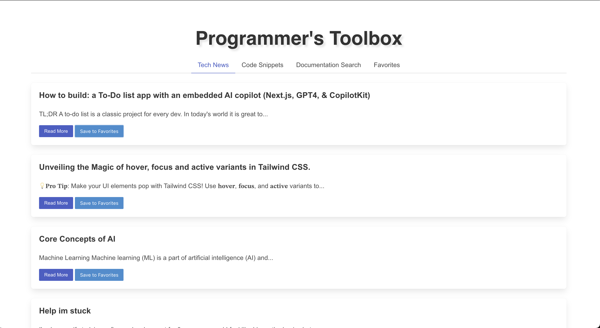
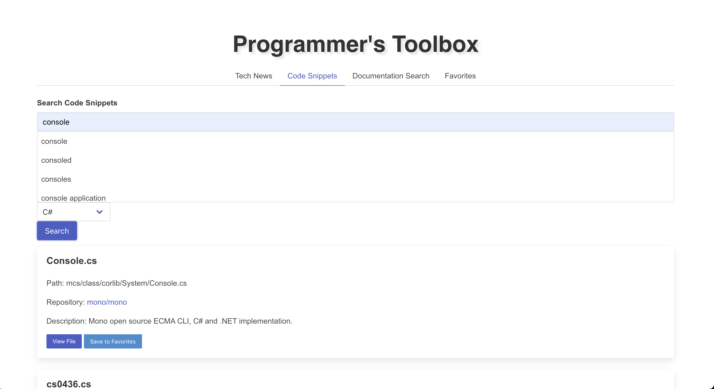

# Programmer's Toolbox Application

## Link to Deployed App

[Programmer's Toolbox](https://programmers-toolbox.up.railway.app/)

## Overview

This repository hosts the code for the Programmer's Toolbox application, a versatile tool designed for developers. The app includes the following features:

- **Tech News Feed:** Provides the latest tech news using the dev.to API.
- **Code Snippet Search:** Allows users to search for code snippets from GitHub Gists.
- **Documentation Search:** Enables users to search for documentation from MDN Web Docs.
- **Favorites:** Users can save their favorite articles, code snippets, and documents for easy access.

## File Structure

### HTML Files

- **index.html**: The main page that displays the Programmer's Toolbox with various tabs for tech news, code snippets, documentation search, and favorites.

### CSS Files

- **./assets/css/styles.css**: General styles for the Programmer's Toolbox application, including styles for tabs, content sections, and modals.

### JavaScript Files

- **./assets/js/scripts.js**: Contains JavaScript code for handling tab navigation, fetching data from APIs (dev.to, GitHub Gists, MDN Web Docs), managing localStorage for favorites, and displaying content dynamically.

## Setup and Running

This package REQUIRES [node.js](https://nodejs.org/en)

To run the application on a local host first you need to clone the repo, then in visual studio or visual studio code open the bash terminal and run "npm i" without quotes to install dependencies.
To enable github features like code snippets and search functionality, you must create a .env file in the project root folder and add this line: "API_KEY=key" without quotes, then go to your github developer settings and create an API key with full scope permissions.
To enable google API features you first need to add a new line to your .env file and add a google API key "GOOGLE_API_KEY=key" without quotes, key being your google API key (google programmable search API key).
after your keys are setup and you have the dependencies installed, run node "server.js" without quotes in your bash terminal, this will run the backend and will secure your API keys.
Then go to [https://localhost:3001](https://localhost:3001)

## Features

### Tech News Feed

- Displays the latest tech news articles from the dev.to API.
- Users can read more by clicking on article links or save articles to favorites.

### Code Snippet Search

- Allows users to search for code snippets using keywords and language filters.
- Fetches public gists from GitHub and displays matching snippets.
- Users can view detailed gist content and save snippets to favorites.

### Documentation Search

- Enables users to search for documentation on MDN Web Docs using the Google Custom Search API.
- Displays search results with links to relevant documentation.
- Users can save documentation links to favorites.

### Favorites

- Users can view and manage their saved articles, code snippets, and documentation links.
- Saved items are stored in localStorage for persistence across sessions.

## Known Issues

- **API Rate Limits:** The application may encounter rate limits from the APIs (dev.to, GitHub, Google Custom Search) if used excessively.
- **LocalStorage:** Favorites will not persist if localStorage is disabled in your browser. Check your browser settings if items are not saving.

## Screenshots

| Tech News | Snippets |
|:---------:|:--------:|
|  |  |
| Document Search | Favorites |
|  |  |

---

Feel free to customize further based on your specific requirements!
